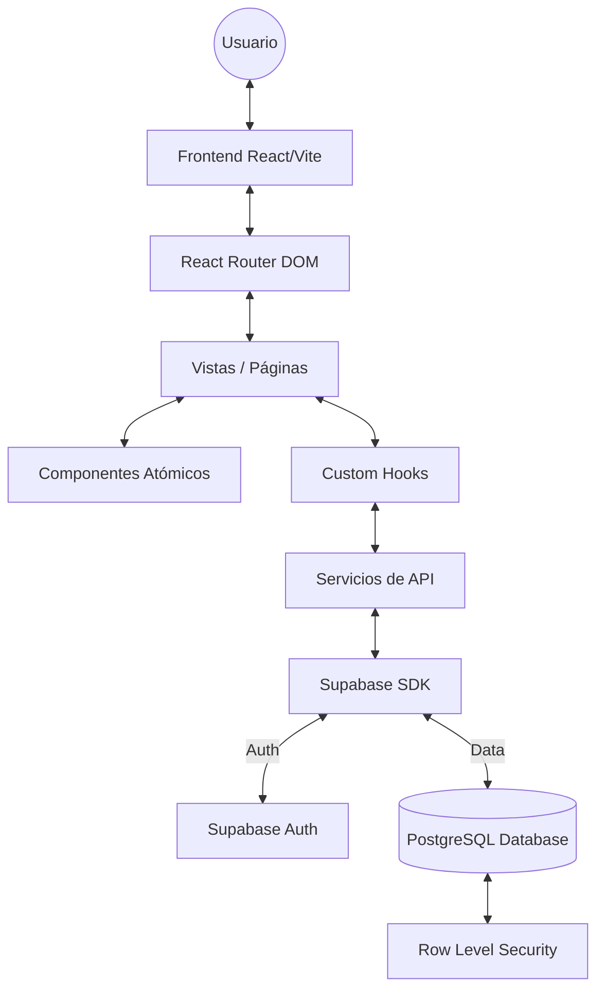
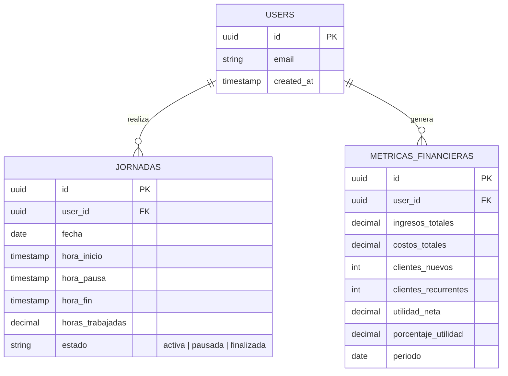

# 🕒 Control Horario App - MVP

Una aplicación web moderna y profesional diseñada para la gestión y control de jornadas laborales, permitiendo a los usuarios registrar sus entradas, salidas, pausas y visualizar métricas financieras clave.

## 🚀 Características Principales

-   **Gestión de Autenticación**: Registro e inicio de sesión seguro mediante **Supabase Auth**.
-   **Control de Jornadas**: Registro preciso de inicio, pausa y fin de jornada con cálculo automático de horas.
-   **Dashboard Financiero**: Visualización de ingresos, costos, utilidad neta y métricas de clientes.
-   **Historial Detallado**: Listado completo de jornadas anteriores con filtros y ordenamiento.
-   **Diseño Responsive**: Interfaz optimizada para dispositivos móviles, tablets y desktop.
-   **Iconografía Profesional**: Uso de la librería `lucide-react` para una estética premium.

## 🛠️ Tech Stack

-   **Frontend**: React (Vite)
-   **Routing**: React Router DOM v7
-   **Backend & Auth**: Supabase
-   **Estilos**: CSS nativo (Variables semánticas y diseño atómico)
-   **Gráficos**: Recharts
-   **Iconos**: Lucide React

## 🏗️ Arquitectura del Sistema



## 📊 Modelo de Datos



## ⚙️ Configuración e Instalación

### Requisitos Previos

-   Node.js (v18 o superior)
-   Cuenta en [Supabase](https://supabase.com/)

### Pasos para el Setup Local

1.  **Clonar el repositorio**:
    ```bash
    git clone <url-del-repositorio>
    cd aaqa
    ```

2.  **Instalar dependencias**:
    ```bash
    npm install
    ```

3.  **Configurar variables de entorno**:
    Crea un archivo `.env` en la raíz basado en `.env.example`:
    ```env
    VITE_SUPABASE_URL=tu_url_de_supabase
    VITE_SUPABASE_ANON_KEY=tu_anon_key_de_supabase
    ```

4.  **Iniciar el servidor de desarrollo**:
    ```bash
    npm run dev
    ```

## 📁 Estructura del Proyecto

```text
src/
├── components/     # Componentes reutilizables (Atómicos)
├── context/        # Context Providers (Auth, Jornada)
├── hooks/          # React Hooks personalizados
├── pages/          # Vistas principales de la aplicación
├── services/       # Integración con Supabase y lógica de negocio
├── styles/         # CSS Global y variables de diseño
└── utils/          # Helpers y constantes
```

## 📜 Scripts Disponibles

-   `npm run dev`: Inicia el servidor de desarrollo con Vite.
-   `npm run build`: Genera el bundle de producción.
-   `npm run preview`: Previsualiza la versión de producción localmente.

---
Proyecto desarrollado como parte del **Sprint 0 - MVP**.
